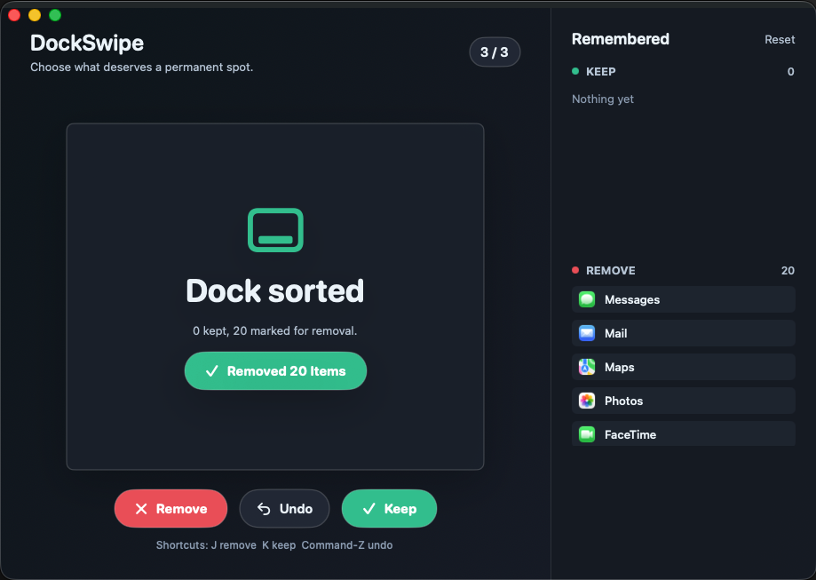

# DockSwipe

A tiny native macOS SwiftUI prototype for cleaning up an overcrowded Dock one app at a time.



## Run

```bash
swift run
```

## Package as an app

```bash
chmod +x scripts/package-app.sh
./scripts/package-app.sh
open dist/DockSwipe.app
```

## Controls

- `j`: mark the visible Dock item for removal
- `k`: keep it
- `Command-Z`: undo the previous decision
- Drag right to keep, drag left to remove

Decisions are stored at `~/Library/Application Support/DockSwipe/decisions.json`, and the final `Apply Cleanup` action updates your Dock.
